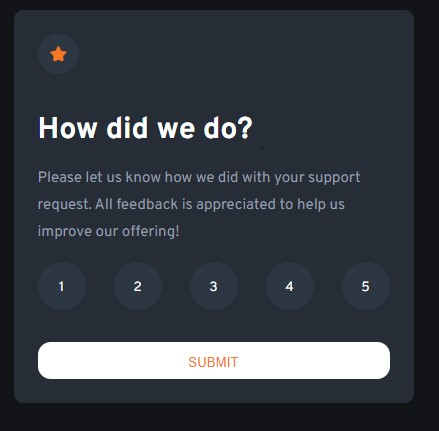
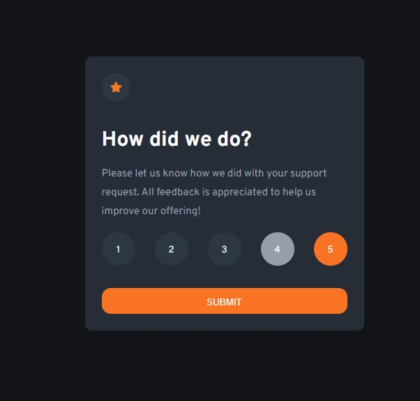
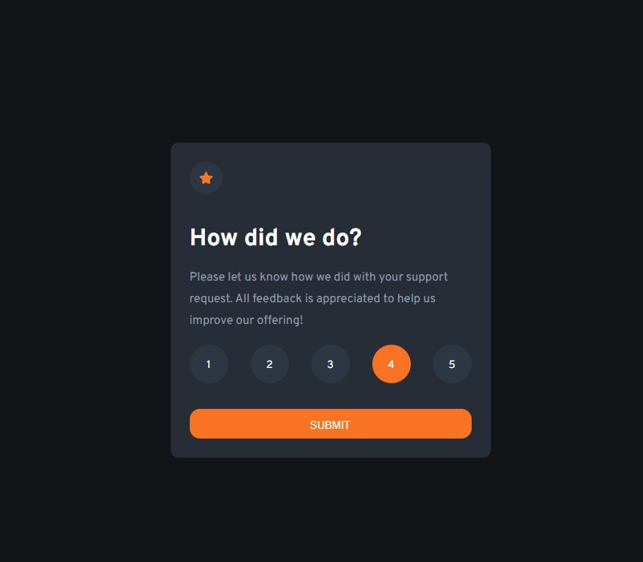
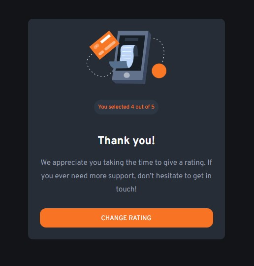

# Frontend Mentor - Interactive rating component solution

This is a solution to the [Interactive rating component challenge on Frontend Mentor](https://www.frontendmentor.io/challenges/interactive-rating-component-koxpeBUmI). Frontend Mentor challenges help you improve your coding skills by building realistic projects. 

## Table of contents

- [Overview](#overview)
  - [The challenge](#the-challenge)
  - [Screenshot](#screenshot)
  - [Links](#links)
- [My process](#my-process)
  - [Built with](#built-with)
  - [What I learned](#what-i-learned)
  - [Continued development](#continued-development)
- [Author](#author)

**Note: Delete this note and update the table of contents based on what sections you keep.**

## Overview

The way I decided to tackle this project as it was my first to incorporate Javascript was to make sure that the CSS and HTML were already done and set out.


### The challenge

Users should be able to:

- View the optimal layout for the app depending on the device's screen size
- See hover states for all interactive elements on the page
- Select and submit a number rating
- See the "Thank you" card state after submitting a rating

### Screenshot











### Links

- Solution URL: (https://github.com/JMujuru/Interactive-rating-componet.github.io)
- Live Site URL: [Add live site URL here](https://your-live-site-url.com)

## My process
Using the nested layout techniques I made the HTML and CSS once this was done I set the thank-you page to hidden so it wouldn't show initially to the user. 

Once this was done I moved on to the Js which gave me a little trouble when I wanted to see if I could make the screen give you an alert if you haven't chosen a rating. 

### Built with

- Semantic HTML5 markup
- Flexbox
- Mobile-first workflow
- Javascript

### What I learned
I learned that if I wanted the alert rating to show again after initially choosing a rating and submitting it that i would have to make sure that the rating.innerHTML would be empty so that the submit event wouldn't skip over the if function.
This was a nice small project to start on and get used to some Javascript 

```js
submit.addEventListener("click", () => {
  if (!rating.innerHTML) {
    alert("You haven't chosen a rating");
    return;
  }
```

### Continued development

I want to improve my DOM knowledge as I struggled a little when assigning elements and creating them I also want to make sure that I can manipulate the dom in the way that I want with the use of my javascript. continued improvement in Javascript is necessary to complete other projects so i will focus on these things 

## Author

- Frontend Mentor - [@JMujuru](https://www.frontendmentor.io/profile/JMujuru)

